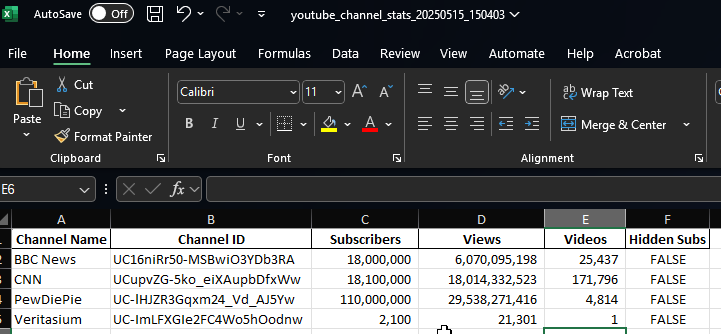

# github-portfolio
# 📊 YouTube Channel Statistics Scraper

This project uses the **YouTube Data API** and **Python** to gather public statistics from selected YouTube channels such as subscriber count, total views, and video count. The data is saved into both CSV and Excel formats with timestamped filenames for organized record-keeping and future analysis.

## 🧠 Project Overview

The goal of this project is to demonstrate basic API integration and data processing skills. By targeting multiple public YouTube channels, it showcases the ability to fetch, structure, and store real-world data for monitoring or analytical purposes.

The data is stored locally in a designated folder and saved in two formats—CSV and Excel—to illustrate different methods of organizing the same dataset.

## ✅ Features

- Fetches public statistics using the YouTube Data API v3
- Supports multiple channel usernames
- Saves data in both `.csv` and `.xlsx` formats
- Timestamped filenames for historical tracking
- Includes error handling for robustness

## 🔧 Technologies Used

- Python 3
- `google-api-python-client`
- `pandas`
- YouTube Data API v3

## 📁 Output Sample

Each run of the script generates:

youtube_channel_stats_YYYYMMDD_HHMMSS.csv or

youtube_channel_stats_YYYYMMDD_HHMMSS.xlsx




## 🚀 Usage

1. Clone this repository:
   ```bash
   git clone https://github.com/Metakrist/github-portfolio.git
2. Install dependencies:
   pip install google-api-python-client pandas openpyxl
3. Add your YouTube Data API key in the script:
   api_key = 'YOUR_API_KEY_HERE'
4. Update the channels list with your target channel usernames.
5. Run the script:
6. Check the output folder (defined by folder_path) for the generated files.

📌 Notes
Make sure your API key has YouTube Data API v3 enabled.

This project uses forUsername, which works for legacy usernames. For modern channels, consider using channelId instead.

🧑‍💻 Author
Krist

GitHub: @Metakrist 

   

